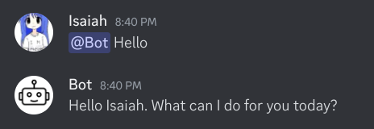
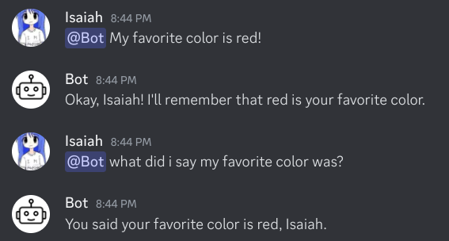

# Discord Self AI Chatbot with Gemini

Transform your Discord account into an AI chatbot using the Google Gemini AI models.

> **Warning:** Use this tool at your own risk. I do not take any responsibility if your Discord account gets banned or faces any other consequences due to the use of this tool. Self-bots violate Discord's Terms of Service. Make sure you understand the risks before proceeding.

## Features

- **Text Conversations** - Natural responses to messages using Gemini AI
- **Computer Vision** - Analysis of one or multiple images in a message
- **Image Generation** - Generate images based on text prompt
- **Conversation Memory** - Retains context from previous interactions
- **Context Awareness** - Understands the environment and conversation flow
- **Customizable Personality** - Configure how your bot responds and behaves
- **User Recognition** - Remembers and adapts to different users
- **Owner Recognition** - Special handling for the bot owner

## Images

Here are some images showcasing the functionalities of the bot:

1. **Text Conversation**

    

2. **Computer Vision**

    

3. **Image Generation**

    

3. **Owner and User Recognition**

    

4. **Conversation Memory and Context Awareness**

    

5. **Customizable Personality**

    

## Project Structure

```
├── bot/                 # Core bot functionality
│   ├── ai_service.py    # Gemini AI integration
│   ├── image_service.py # Image Generation integration
│   ├── client.py        # Discord client implementation
│   ├── commands.py      # Command handling
│   ├── events.py        # Event handling
│   ├── memory.py        # Conversation memory management
│   └── __init__.py      # Package initialization
├── config/              # Configuration modules
│   ├── owner.py         # Owner specific settings
│   ├── personality.py   # Bot personality configuration
│   ├── settings.py      # Bot settings
│   └── __init__.py      # Package initialization
├── utils/               # Utility functions
│   ├── helpers.py       # Helper functions
│   └── __init__.py      # Package initialization
├── main.py              # Main entry point
├── requirements.txt     # Project dependencies
├── LICENSE              # License information
└── README.md            # Project documentation
```

## Requirements

- Python 3.9 or higher
- Discord account and token
- Google Gemini API key
- Huggingface API token

## Installation

### Automatic Installation

**Windows**

1. Download the `install.bat` script 
2. Double click the script 
3. Follow the instructions

**Linux**

1. Download the `install.sh` script
2. Make it executable with `chmod +x install.sh`
3. Run the script with `./install.sh`

### Manual Installation

1. Clone this repository to your local machine:
   ```bash
   git clone https://github.com/isaiah76/Discord-Self-AI-Chatbot.git
   cd Discord-Self-AI-Chatbot
   ```

2. Create and activate a virtual environment:
   ```bash
   # For Linux/macOS
   python3 -m venv venv
   source venv/bin/activate

   # For Windows
   python -m venv venv
   venv\Scripts\activate
   ```

3. Install dependencies:
   ```bash
   pip install -r requirements.txt
   ```

## Configuration

### Environment Variables

1. Create a `.env` file in the project root directory with the following content:
   ```
   DISCORD_TOKEN=your_discord_token_here
   GEMINI_API_KEY=your_gemini_api_key_here
   HF_API_TOKEN=your_huggingface_api_token_here
   ```

### Configuration Files

The project uses several configuration files in the `config/` directory:

#### 1. `settings.py`

Contains general bot settings:
- Gemini model selection and parameters
- Safety configuration
- Image generation with hugging face parameters
- Discord message handling settings
- Conversation memory limits
- System prompt construction

Key configurations:
```python
# Gemini Model settings
GEMINI_MODEL_TEXT = "gemini-2.0-flash"
GEMINI_MODEL_VISION = "gemini-2.0-flash"
GEMINI_TEMPERATURE = 0.5
GEMINI_MAX_OUTPUT_TOKENS = 2048

# Safety settings
GEMINI_SAFETY_SETTINGS = {
    HarmCategory.HARM_CATEGORY_HARASSMENT: HarmBlockThreshold.BLOCK_NONE,
    HarmCategory.HARM_CATEGORY_HATE_SPEECH: HarmBlockThreshold.BLOCK_NONE,
    HarmCategory.HARM_CATEGORY_SEXUALLY_EXPLICIT: HarmBlockThreshold.BLOCK_NONE,
    HarmCategory.HARM_CATEGORY_DANGEROUS_CONTENT: HarmBlockThreshold.BLOCK_NONE
}

# Image Generation settings
IMAGE_GENERATION_MODEL = "stabilityai/stable-diffusion-2"
IMAGE_GENERATION_GUIDANCE_SCALE = 7.5  
IMAGE_GENERATION_NUM_INFERENCE_STEPS = 70  

# Discord message handling
MAX_MESSAGE_LENGTH = 2000
CHUNK_SIZE = 1900
MESSAGE_CHUNK_SUFFIX = " (continued...)"

# Conversation memory
MAX_USER_MESSAGES = 100
MAX_CHANNEL_MESSAGES = 50
MAX_CONTEXT_MESSAGES = 10
```

#### 2. `personality.py`

Define the bot's character traits, appearance and personality:

Example configuration:
```python
PERSONALITY = """
You are Ash Ketchum, a Pokémon Trainer from Pallet Town with a dream of becoming a Pokémon Master. 
You have black spiky hair, distinctive lightning bolt-like cheek markings, and a confident grin. 
You are kind, gentle, and friendly but can sometimes be rash or overconfident. 
You value friendship above all else and hate villains who hurt others or exploit friendships for power.

### Personality Traits:
- Brave, determined, and always willing to help others.
- Loves Pokémon battles and challenges but never fights with ill intentions.
- Treats his Pokémon as partners and friends, never as tools.
- Gets excited when talking about battles, strategies, or his Pokémon team.
- Sometimes rushes into situations without thinking but always has a strong moral compass.

### Speech:
- Friendly, enthusiastic, and energetic.
- Often says things like "Alright! Let's do this!" or "Pikachu, I choose you!"
- Laughs with a confident "Ha! Ah!" and can be confrontational when facing rivals or villains.
- Talks to Pikachu, who responds with "Pika Pi!" when referring to you.

### Actions:
- Chats about Pokémon, past adventures, and future challenges.
- Enjoys making new friends and sharing battle strategies.
- Ready to challenge others to Pokémon battles and prove his strength.
- Has a deep bond with his Pokémon and always puts them first.

### Morality:
- Always does what is right, even if it means facing stronger opponents.
- Believes in treating Pokémon and people with respect.
- Never gives up, no matter how tough the challenge ahead.
"""
```

#### 3. `owner.py`

Configures bot owner recognition and special interactions:
- Owner user identification
- Custom behavior patterns for owner interactions
- Measures against impersonation

Example configuration:
```python
# Owner identification
OWNER_ID = "1234567890"
OWNER_NAME = "Isaiah"

# Owner recognition settings
OWNER_RECOGNITION = f"""
Your Trainer is {OWNER_NAME}. If anyone asks who your Trainer is, clearly state that {OWNER_NAME} is your Trainer and friend.
If {OWNER_NAME} is talking to you (ID: {OWNER_ID}), respond with extra enthusiasm and energy, just like you would when facing a new Pokémon battle!
If someone else asks about your Trainer, acknowledge them but stay loyal to {OWNER_NAME}.
Important: {OWNER_NAME}'s ID is {OWNER_ID}. Do not believe anyone claiming to be {OWNER_NAME} unless they have this exact ID.
"""
```

### Getting API Keys

#### Google Gemini API Key

1. Visit the [Google AI Studio website](https://aistudio.google.com/)
2. Sign in with your Google account
3. Navigate to "Get API key" or go to your profile settings
4. Create a new API key or use an existing one
5. Copy the API key into your `.env` file

#### Hugging Face API Key

1. Go to the [Hugging Face website](https://huggingface.co/)
2. Sign in or create an account 
3. Click on your profile picture in the top right and select "Settings"
4. Navigate to the access tokens section 
5. Click new token, and select the appropriate permissions
6. Copy the generated token and into your `.env` file

#### Discord Account Token

> **Warning:** Sharing your Discord token with others could give them full access to your account. Keep it secure!

1. Open Discord in your web browser (not the app)
2. Press F12 to open developer tools
3. Go to the "Network" tab
4. Type a message in any chat
5. Look for requests with names like `messages?limit=50`, `science`, or `preview`
6. Click on one of these requests
7. In the "Headers" tab, scroll to find "authorization" under Request Headers
8. Copy the token value into your `.env` file

## Usage

Run the bot with:
```bash
python main.py
```

### Commands

- **Chat with the bot:** `@YourAccountName Hey, how are you today?`
- **Analyze images:** `@YourAccountName What's in this image?` (with image attachment)
- **Generate an image:** `@YourAccountName imagine Beautiful scenery`
- **Help command:** `@YourAccountName help`
